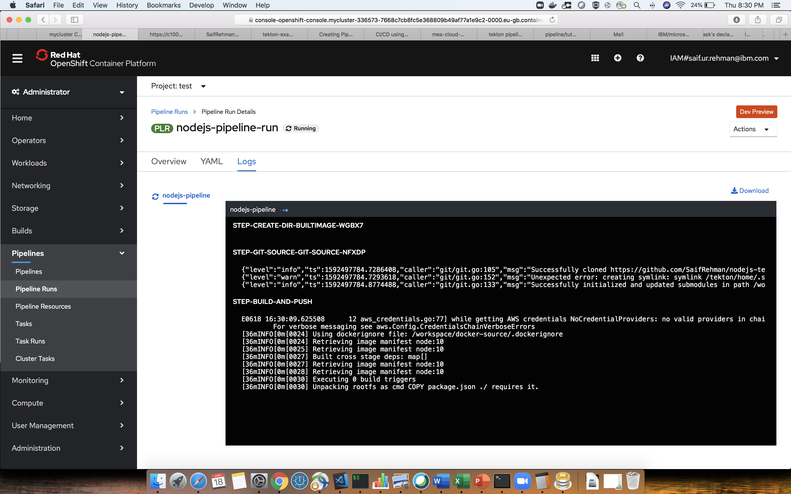

# nodejs-tekton-openshift

This guide is to run a sample application on openshift cluster using tekton 

# Prereq

* Install Tekton

1. Navigate to Operator Hub
2. Search tekton
3. Subscribe and Install 

# Deploy a sample nodejs application using tekton

1. clone the repo 

```
$ git clone https://github.com/SaifRehman/nodejs-tekton-openshift.git
```
2. Navigate to the directory 

```
$ cd nodejs-tekton-openshift
```

* in ```kubernetes``` folder you have all kubernetes artifacts
* in ```tekton``` folder you have tekton configuaration 
* ```tekton/resources.yaml``` specified git repo and private images repo 
* ```tekton/task.yaml``` specifies all the tasks, such as build push and deploy. each tasks has specefic steps 
* ```tekton/pipeline.yaml``` configures pipeline and specifes what tasks to run
* ```tekton/pipelinerun.yaml``` Runs the given pipeline 

3. Configure secret 

* Create ```docker.cofig.json```
```
$ touch docker.cofig.json
```
* populate with the following data 


```JSON
{
  "auths": {
    "docker-registry.default.svc.cluster.local:5000": {
      "auth": "c2E6ZXlKaGJHY2lPaUp<...skipped many lines ...>"
    }
  }
}
```
* ```auth``` entry needs to change
* get secret 
```
$ secret=$(oc get secret  | grep pipeline-token | head -1 | awk '{print $1}')
```
* get token
```
$ token=$(oc get secret $secret -o jsonpath="{.data.token}")
```
```
token = $(echo $token | base64 --decode)
```

```
echo "sa:$token" | base64

```
* copy it and paste it in auth 

* Create a docker secret 
```
$ kubectl  create configmap docker-config --from-file=config.json=docker.config.json
```
4. Apply tekton yaml

```
$ kubectl apply -f resources.yaml
$ kubectl apply -f task.yaml
$ kubectl apply -f pipeline.yaml
$ kubectl apply -f pipelinerun.yaml
```

5. Open openshift dashboard and navigate to pipeline and then pipeline run to see the running pipeline




